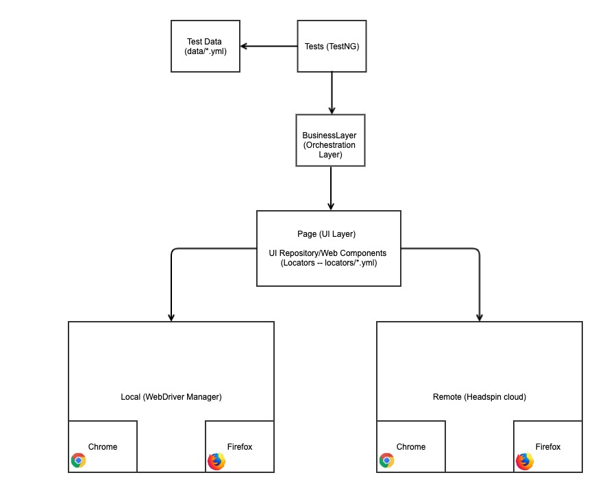
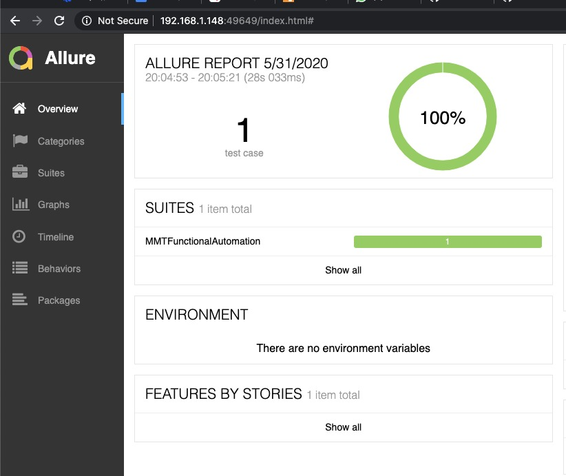

### MMT Automation For Headspin Hackathon

**Pre-requisite:**

- Java 14 (Installation guide: https://jdk.java.net/14/)
- Maven (Installation: https://maven.apache.org/download.cgi)

**Architecture diagram:**

**User Journey:**

- Search Flights based on City,Checkin Dates, Occupants and purpose of stay
- Select hotel
- Review Details
- Check payment option 

To Run:
- Clone repo `git clone https://github.com/bitweft/hawk_eye_mmt_e2e_test.git`
- Run as test using maven `mvn clean test -Dsurefire.suiteXmlFiles=<path/of/testNG.xml>'
- Allure Report 
 